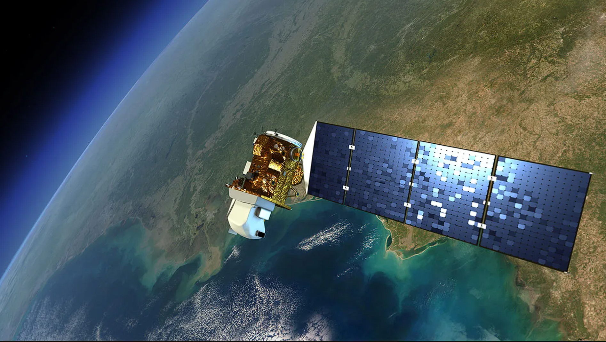
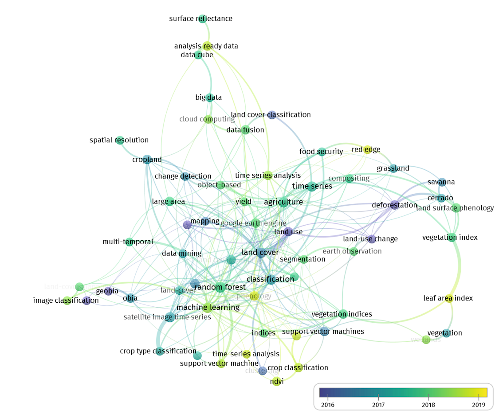

class: center, middle

# Sensor

### /ˈsɛnsə/
### a device which detects or measures a physical property and records, indicates, or otherwise responds to it.

---
# Landsat-8

* Landsat-8 is a Earth Observation Satellite launched by NASA/USGS in 2013

* The satellite carries two instruments: 

  1. Operational Land Imager (OLI)
  
  2. Thermal Infrared Sensor (TIRS) 
  
* The OLI measures in the visible, near infrared, and shortwave infrared wavelengths in 9 spectral bands (15-30m resolution) while TIRS measures and surface temperature in two thermal bands (100m resolution)

```{r,echo=FALSE, out.width="45%", fig.align="left"}

```
*Landsat-8 in Orbit. Source: [NASA](https://science.nasa.gov/mission/landsat-8-ldcm/)*

---

# Landsat-8 Products 

* There are multiple data products available for download for Landsat-8: 
  
  1. Level 1 products - radiometrically and geometrically corrected data to remove any distortion from the sensor, satellite and the Earth. Cloud masks are also provided in this product.
  
  2. Level 2 products - generated from Level 1 products through algorithms such as LaSRC to create products like surface reflectance and surface temperature.
  
  3. Analysis Ready Data (ARD) - pre-processed data for immediate use in scientific analysis such as time series and machine learning; these are obtained from Level 1 products. 
  
* Landsat-8 also comprises of Collection 1 and 2, with Collection 2 being more recent (2020) and having an improved accuracy and better atmospheric and radiometric calibration.

---

# Applications 

* There are wide range of application of the Landsat-8 data; some more common than others
  
  * For example, Surface Temperature, a Level 2 product, is specifically generated as a geophysical parameter which is useful in global energy balance studies and modelling. It is also useful in studying urban heat island, wildfires, and even phenological processes. 
  
  * Schroder et. al (2016) developed an active fire detection algorithm using Landsat-8 data which provided enhanced coverage and resolution for fire management over a global region.
  
  * Guha et. al (2018) on the other hand, examined the relationship between Land Surface Temperature with Normalised Difference Vegetation Index and Normalised Difference Built-up Index through linear regression models. These indices are formed by transforming different bands found in Landsat-8 data. 

---

# Applications II
The tabs below illustrate some of the applications, methods orgaanised by general topics. Of course, the lists are non-exhaustive - there a wide range of applications of Landsat-8 data which this summary cannot capture. 


```{r xaringan-panelset, echo=FALSE}
xaringanExtra::use_panelset()
```


.panelset[
.panel[.panel-name[Topic of Interest]

 * **Climate Change**: energy balance, water/carbon cycle, flood risk etc
 
 * **Environment**: soil health, phenology, vegetation composition etc 
 
 * **Human activities:** urbanisation, deforestation, industralisation, heat island etc 
 
 * **Natural disasters:** earthquakes, tsunamis, forest fires etc 
 
 * **Minerals:** mineral detection 
 
 
]

.panel[.panel-name[Methods used]

 * Cloud computing 
 
 * Supervised/Unsupervised classification 
 
 * Artificial Neural Networks / Deep learning 
 
 * Clustering 
 
 * Time Series 
 
 
]

.panel[.panel-name[Mindmap]

<div class="row">
  <div class="col-left" style="width: 70%; float: left;">
    ```{r, echo=FALSE, out.width="80%"}
    
    ```
  </div>
  <div class="col-right" style="width: 30%; float: right; padding-left: 20px;">
    Scientific network mapping by <a href="https://www.mdpi.com/2072-4292/12/18/3062" target="_blank">Chaves et. al (2020)</a> highlights the evolution of keywords used by remote sensing papers that utilised Landsat-8 data. 
    
  </div>
</div>


]
]

---

# Reflections 

I decided to split my reflection across three topics this week based on the content that I learnt: 

.panelset[
.panel[.panel-name[Landsat-8]

 * While satellite imagery is incredibly useful, different sensors suffers from different disadvantages whether it is poor resolution or lack of continuous data. Researchers often have to compensate using algorithms or combine them with other datasets. Landsat-8 data are thus usually not used in silo in a project. 
 
 * There is so much work that goes behind capturing satellite imagery - I spend some time looking through the [Landsat-8 Data User Handbook](https://d9-wret.s3.us-west-2.amazonaws.com/assets/palladium/production/s3fs-public/atoms/files/LSDS-1574_L8_Data_Users_Handbook-v5.0.pdf) (over 100 pages!!) and I was overwhelmed by the different calibrations and product descriptions but I also learnt that image capturing is not always accurate. 
 
 * Known issues like stray light produces lunar ghosts which require further characterisation and correction (e.g  0.29 W/m2/sr/µm for Band 10)
 
]

.panel[.panel-name[Xaringan]

 * While my first initial thought of using Rmarkdown to code a presentation was "Eh?!", I found using Xaringan more straightforward than I thought 
 
 * The ease of running code chunks *in-situ* to generate tables, graphs and plots makes it really refreshing to use rather than screenshotting plots from RStudio and placing them in a powerpoint presentation 
 
 * The extra tools provided by XaringanExtra is really useful as well - including this panelset function that I used to organise this reflection 
 
 
]

.panel[.panel-name[Quarto]

 * I had prior experience from CASA0013 using Quarto to render PDF documents but I learnt a new way of exporting HTMLs and hosting them on github to produce a website. This opened new opportunities for me to share my work with others 
 
 * The practice of using Quarto also helped me build confidence using this software, which I believe can help me organise and format my upcoming dissertation. 
 
 * After reading up a bit on Quarto, I came to realise how important open-source data and software are especially in spatial data science. From the data sources like Landsat-8 to writing reports on Quarto or presenting on Xaringan, open source projects and packages help enable collaborations, builds on reproducibility in scientific investigations.  


]
]


---
